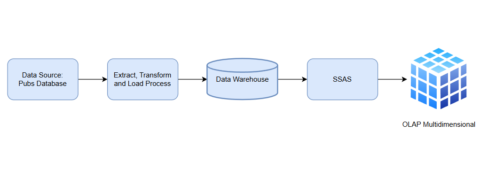
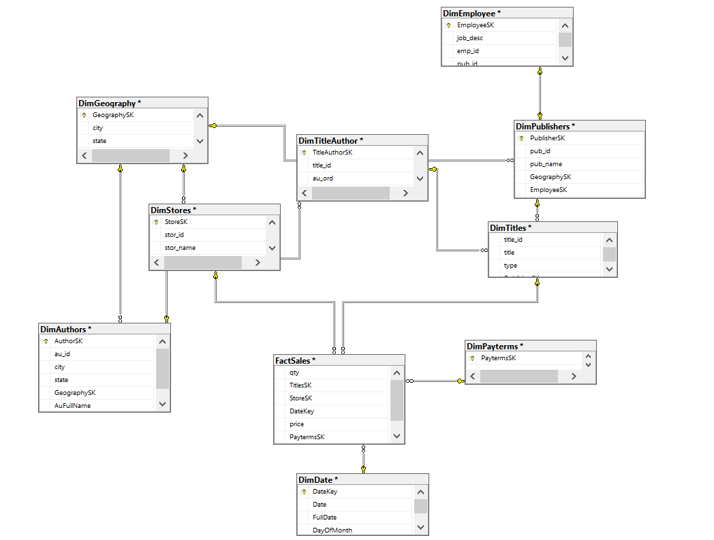
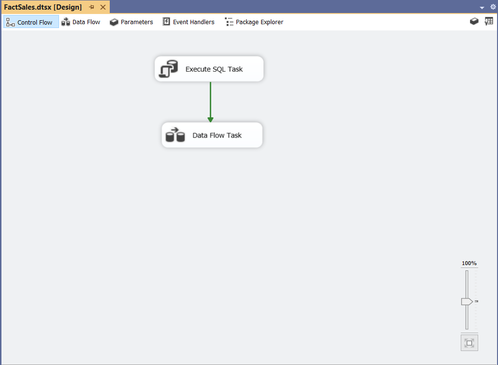
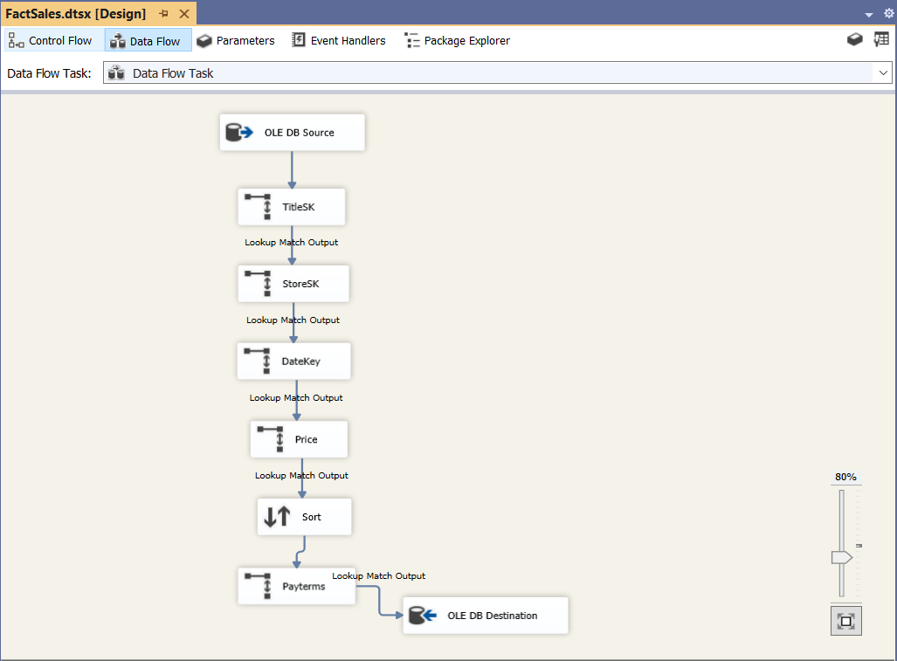
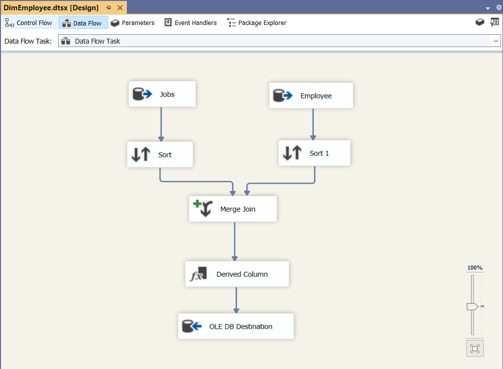
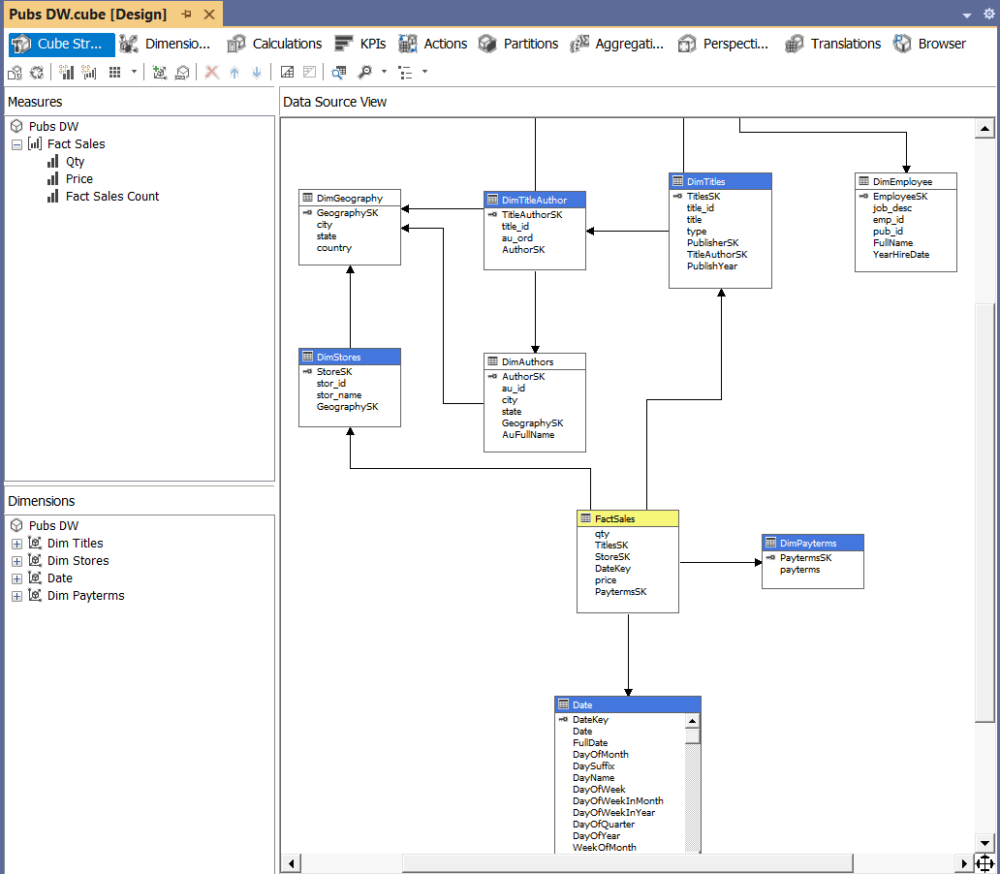
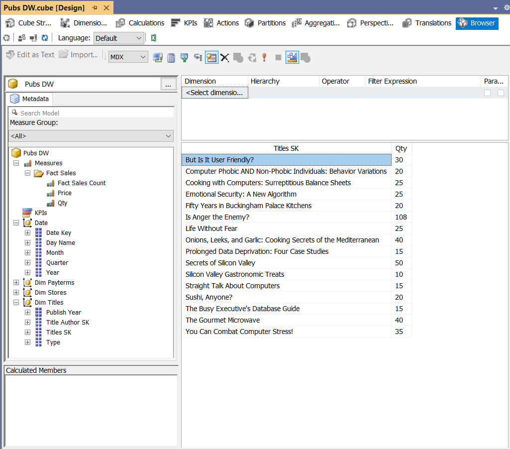

# Pubs-Business-Intelligence
Data Warehouse and SSAS Multidimensional OLAP project built from the Microsoft Pubs database.
# 📚 Pubs Business Intelligence Project


An end-to-end Business Intelligence project built on the **Microsoft Pubs** sample database.

This project demonstrates the complete Business Intelligence workflow, starting from an **OLTP database**, followed by **ETL development using SQL Server Integration Services (SSIS)**, **Data Warehouse implementation with a Snowflake Schema**, and finally the creation of an **OLAP Multidimensional model using SQL Server Analysis Services (SSAS)** for analytical reporting.

The project was developed using **SQL Server 2022**, following dimensional modeling principles and implementing a **Full Load ETL strategy** to ensure data consistency during data refresh operations.

---

# 📋 Project Summary

| Property | Value |
|-----------|-------|
| Repository | **Pubs-Business-Intelligence** |
| Source Database | Microsoft Pubs |
| SQL Server Version | SQL Server 2022 |
| Data Warehouse | PubsDW |
| ETL Tool | SQL Server Integration Services (SSIS) |
| OLAP Tool | SQL Server Analysis Services (SSAS) Multidimensional |
| Data Warehouse Schema | Snowflake Schema |
| Dimensions | 9 |
| Fact Tables | 1 |
| Cube Name | Pubs DW |
| Loading Strategy | Full Load |
| Measures | Qty, Price |

---

# 🏗️ Data Architecture

The following architecture illustrates the overall Business Intelligence pipeline implemented in this project.



The solution follows a complete Business Intelligence workflow:

1. Read transactional data from the Microsoft Pubs OLTP database.
2. Transform and cleanse data using SSIS.
3. Load data into the PubsDW Data Warehouse.
4. Build a Multidimensional OLAP Cube using SSAS.
5. Analyze business data through the Cube Browser and export analytical results to Microsoft Excel.

---

# ❄️ Snowflake Schema

The Data Warehouse was designed using a **Snowflake Schema**.

Unlike a traditional Star Schema, repeated geographical information was normalized into a dedicated **DimGeography** dimension to reduce redundancy and improve consistency across multiple dimensions.

The following dimensions reference **DimGeography**:

- DimAuthors
- DimPublishers
- DimStores

This design provides better data consistency while maintaining an analytical structure suitable for Business Intelligence workloads.



---

# 🔄 ETL Process

The ETL process was developed using **SQL Server Integration Services (SSIS)**.

Several SSIS transformations were used throughout the project to prepare and load the warehouse.

## Components Used

- Execute SQL Task
- Data Flow Task
- Derived Column
- Sort
- Merge Join
- Lookup
- OLE DB Source
- OLE DB Destination

---

## Full Load Strategy

A **Full Load** strategy was implemented throughout the ETL process.

Before loading new records into each destination table, an **Execute SQL Task** performs a **TRUNCATE TABLE** operation to remove existing warehouse data.

After truncation, the corresponding **Data Flow Task** reloads fresh data from the OLTP database.

This approach prevents data duplication and ensures consistency between the source database and the Data Warehouse.



# 🏛️ Data Warehouse Design

The **PubsDW** Data Warehouse was designed following dimensional modeling principles to support analytical queries and Business Intelligence reporting.

The warehouse consists of **9 Dimension tables** and **1 Fact table**.

## Dimension Tables

- DimAuthors
- DimDate
- DimEmployee
- DimGeography
- DimPayTerms
- DimPublishers
- DimStores
- DimTitleAuthor
- DimTitles

## Fact Table

- FactSales

---

## Fact Table Grain

The grain of the **FactSales** table is defined as:

> Each record represents the sale of a specific book title by a specific store on a specific date under a specific payment term.

This level of granularity allows business users to analyze sales across multiple business dimensions.

---

## Measures

The FactSales table contains the following measures:

| Measure | Description |
|----------|-------------|
| Qty | Quantity of books sold |
| Price | Unit price of the book |

---

## Foreign Keys

The FactSales table references the following dimensions using **Surrogate Keys**:

- TitlesSK
- StoreSK
- DateKey
- PayTermsSK

---

## Surrogate Keys

All dimension tables use **Identity Primary Keys** as Surrogate Keys.

Lookup transformations were used during the ETL process to retrieve the appropriate Surrogate Keys before loading the Fact table.

---

# ⚙️ ETL Workflow

## FactSales Data Flow

The FactSales package is the core of the ETL process.

During loading, Lookup transformations are used to replace business keys with Surrogate Keys from the corresponding dimension tables before inserting data into the Fact table.



---

## DimEmployee Data Flow

The **DimEmployee** dimension was created by combining data from the **Employee** and **Jobs** tables using the **Merge Join** transformation.

This approach demonstrates how data from multiple OLTP tables can be integrated into a single analytical dimension.



---

# 📊 OLAP Multidimensional Model

After completing the Data Warehouse, an **OLAP Multidimensional Cube** was developed using **SQL Server Analysis Services (SSAS)**.

The cube enables fast multidimensional analysis based on the warehouse data.

---

## Cube Information

| Property | Value |
|----------|-------|
| Project | PubsMultidimensional |
| Cube Name | Pubs DW |
| Measure Group | FactSales |

---

## Cube Dimensions

The following dimensions were included in the cube:

- Authors
- Date
- Employee
- Geography
- PayTerms
- Publishers
- Stores
- Titles

> **Note:** The **DimTitleAuthor** table was intentionally excluded from the cube. Since it acts as a bridge table between Authors and Titles, its analytical role was represented through the Titles dimension to simplify the multidimensional model.

---

## Cube Structure

The following image shows the overall structure of the Multidimensional Cube.



---

## Cube Browser

After deployment and processing, the cube was explored using the **SSAS Cube Browser**.

Analytical results were also exported to Microsoft Excel, allowing Pivot Table analysis on the processed cube data.




# 🛠️ Technologies Used

The following technologies and tools were used throughout this project:

| Technology | Purpose |
|------------|---------|
| SQL Server 2022 | Database management and Data Warehouse implementation |
| SQL Server Management Studio (SSMS) | Database development and SQL scripting |
| Visual Studio | Development environment for SSIS and SSAS projects |
| SQL Server Integration Services (SSIS) | ETL development and data loading processes |
| SQL Server Analysis Services (SSAS) Multidimensional | OLAP Cube development and multidimensional analysis |
| Draw.io | Data Architecture and Schema design |

---

# 📂 Repository Structure

The repository is organized as follows:

```text
Pubs-Business-Intelligence

├── README.md
│
├── Images
│   ├── PubsDWArchitecture.png
│   ├── SnowflakeSchema.png
│   ├── SSIS_ControlFlow.png
│   ├── FactSalesDataFlow.png
│   ├── DimEmployeeDataFlow.png
│   ├── CubeStructure.png
│   └── OLAP_CubeBrowser.png
│
├── SQL
│   ├── Create_DimAuthors.sql
│   ├── Create_DimDate.sql
│   ├── Create_DimEmployee.sql
│   ├── Create_DimGeography.sql
│   ├── Create_DimPayTerms.sql
│   ├── Create_DimPublishers.sql
│   ├── Create_DimStores.sql
│   ├── Create_DimTitleAuthor.sql
│   ├── Create_DimTitles.sql
│   └── Create_FactSales.sql
│
├── SSIS
│   ├── PubsDW.dtproj
│   ├── PubsDW.sln
│   └── SSIS Packages (.dtsx)
│
└── SSAS
    ├── PubsMultidimensional.smproj
    ├── PubsMultidimensional.sln
    ├── Cubes
    ├── Dimensions
    ├── Data Sources
    └── Data Source Views
```

---

# ⭐ Key Features

- Designed and implemented an end-to-end Business Intelligence solution.
- Built a Snowflake Schema Data Warehouse from an OLTP database.
- Developed ETL workflows using SQL Server Integration Services (SSIS).
- Implemented Full Load strategy using Execute SQL Task and TRUNCATE TABLE operations.
- Applied Lookup transformations to retrieve Surrogate Keys during Fact loading.
- Integrated data from multiple source tables using Merge Join transformations.
- Designed an SSAS Multidimensional Cube for analytical processing.
- Performed multidimensional analysis using Cube Browser and exported results to Excel.
- Applied dimensional modeling concepts including Fact and Dimension design.

---

# 🎯 Learning Outcomes

Through this project, I gained practical experience in:

- Understanding the transition from OLTP systems to analytical Data Warehouse environments.
- Designing dimensional models using Snowflake Schema.
- Developing ETL pipelines with SSIS.
- Working with Surrogate Keys and Lookup transformations.
- Integrating multiple source tables into analytical dimensions.
- Building and processing OLAP Multidimensional Cubes using SSAS.
- Performing analytical exploration through OLAP tools.
- Documenting a complete Business Intelligence project workflow.

---

# 🚀 Future Improvements

Possible improvements for future versions of this project include:

- Implementing Incremental Load strategies instead of Full Load.
- Adding Slowly Changing Dimensions (SCD) for historical tracking.
- Creating SSAS Hierarchies and Attribute Relationships.
- Developing KPIs and Calculated Members in SSAS.
- Building interactive dashboards using Power BI on top of the Data Warehouse or OLAP Cube.

---

# 📌 Project Status

✅ Completed

This project represents a complete Business Intelligence workflow, covering the journey from transactional data to analytical reporting.
